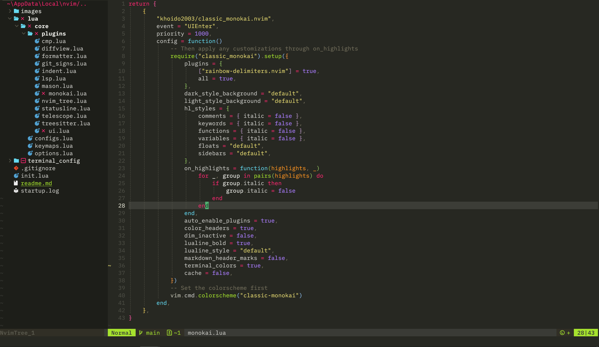
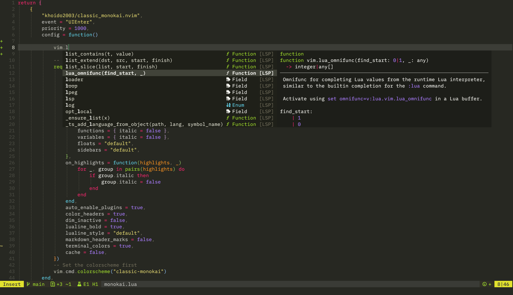
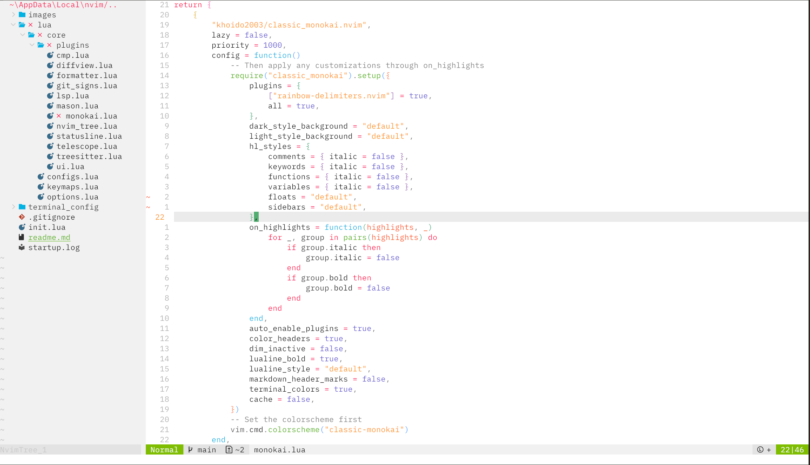

# 🎨 Classic Monokai

> A Neovim colorscheme that brings back the beloved Monokai experience from Sublime Text.

## 💝 Story Behind This Theme

I've always been in love with the original Monokai theme from Sublime Text - its vibrant colors and perfect readability made coding a true joy. This theme is my attempt to bring that same magical experience to Neovim.

This colorscheme is a fork of [monokai-nightasty.nvim](https://github.com/polirritmico/monokai-nightasty.nvim) by [@polirritmico](https://github.com/polirritmico). His incredible work laid the foundation for this theme, and I'm deeply grateful for his contribution to the Neovim community. I've made some adjustments to bring the colors closer to the classic Sublime Text Monokai experience while keeping the modern Neovim features intact.

## ⚡️ Requirements

- Neovim >= 0.10.0
- True color terminal support

## 📦 Quick Start

Using [lazy.nvim](https://github.com/folke/lazy.nvim):

```lua
{
  "khoido2003/classic_monokai.nvim",
  lazy = false,
  priority = 1000,
  config = function()
    -- Default configuration
    require("classic_monokai").setup()
    vim.cmd.colorscheme("classic-monokai")
  end
}
```

## ⚙️ Configuration

Want to customize? Here's an example with common options:

```lua
require("classic_monokai").setup({
  -- Choose style: "dark" or "light"
  style = "dark",
  
  -- Make comments and keywords italic
  hl_styles = {
    comments = { italic = true },
    keywords = { italic = true },
  },
  
  -- Use transparent background
  dark_style_background = "transparent",
})
```

## 🎨 Color Palette

### Dark Theme (Classic Monokai Colors)
| Color   | Hex     | Used For |
|---------|---------|----------|
| Yellow  | #e6db74 | Strings |
| Purple  | #ae81ff | Constants |
| Green   | #a6e22e | Functions |
| Blue    | #66d9ef | Types |
| Magenta | #f92672 | Keywords |
| Orange  | #fd971f | Parameters |

### Light Theme
| Color   | Hex     | Used For |
|---------|---------|----------|
| Yellow  | #c49619 | Strings |
| Purple  | #9d65ff | Constants |
| Green   | #7da900 | Functions |
| Blue    | #4499bf | Types |
| Magenta | #f92672 | Keywords |
| Orange  | #f37b3f | Parameters |

## 📸 Screenshots

<details>
<summary>Dark Theme</summary>






</details>

<details>
<summary>Light Theme</summary>



</details>

## ⌨️ Commands

- `:colorscheme classic-monokai` - Apply the theme
- `:MonokaiToggleLight` - Switch between dark/light modes

## 📚 Documentation

- View the full documentation inside Neovim with `:help classic-monokai`
- [Online documentation](doc/classic_monokai.txt) - Browse the documentation on GitHub
- [Configuration examples](examples/config.md) - Common configuration examples

The documentation includes:
- Complete configuration options
- Highlight group customization
- Plugin integrations
- Tips and troubleshooting

## 🤝 Contributing & Credits

This theme wouldn't exist without:

- [monokai-nightasty.nvim](https://github.com/polirritmico/monokai-nightasty.nvim) by [@polirritmico](https://github.com/polirritmico) - The foundation of this theme
- The original Monokai color scheme by Wimer Hazenberg
- Sublime Text's Monokai theme that inspired this project

### Contributing

If you'd like to help improve this theme:

- Open an issue if you find any bugs
- Submit a PR if you have any improvements
- Share your ideas through discussions

This theme is a fork of monokai-nightasty.nvim and follows its open-source spirit. Feel free to:
- Report issues
- Suggest improvements
- Submit pull requests

## 📝 License

This project is open source and available under the same license as monokai-nightasty.nvim.
