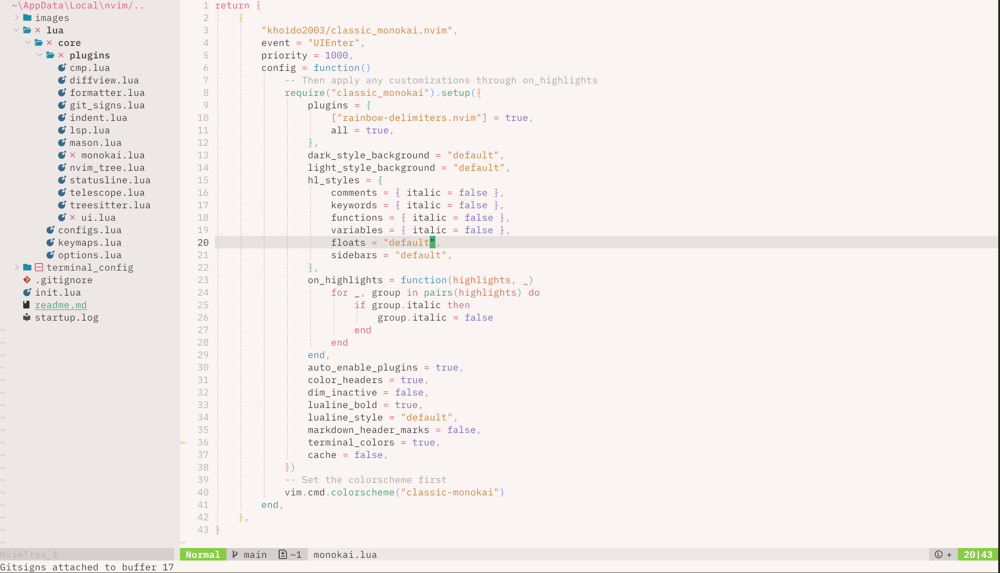
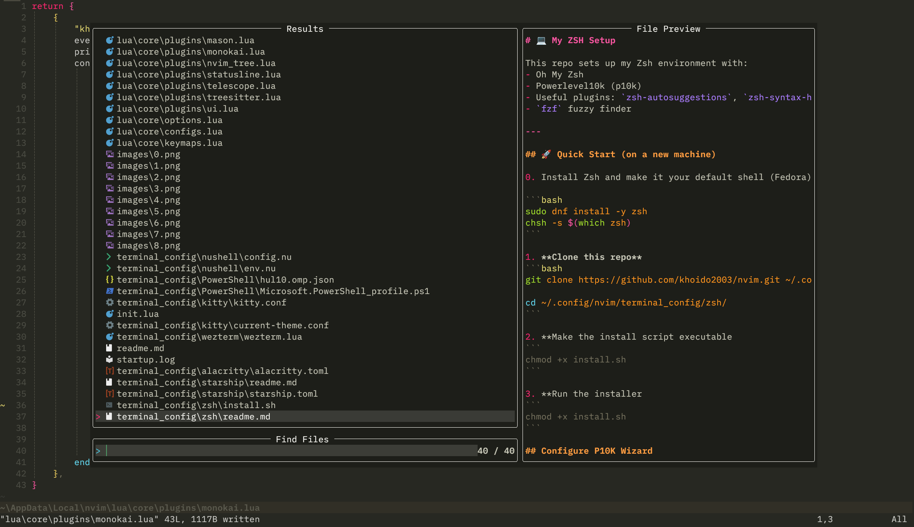

<p align="center">
  
</p>

# 🎨 Classic Monokai

> A Neovim colorscheme that brings back the beloved Monokai experience from Sublime Text.

## 💝 Story Behind This Theme

I've always been in love with the original Monokai theme from Sublime Text - its vibrant colors and perfect readability made coding a true joy. This theme is my attempt to bring that same magical experience to Neovim.

This colorscheme is a fork of [monokai-nightasty.nvim](https://github.com/polirritmico/monokai-nightasty.nvim) by [@polirritmico](https://github.com/polirritmico). His incredible work laid the foundation for this theme. I've made some adjustments to bring the colors closer to the classic Sublime Text Monokai experience while keeping the modern Neovim features intact.

## ⚡️ Requirements

- Neovim >= 0.10.0
- True color terminal support

## 📦 Quick Start

Using [lazy.nvim](https://github.com/folke/lazy.nvim):

```lua
{
  "khoido2003/classic_monokai.nvim",
  lazy = false,
  priority = 1000,
  config = function()
    -- Default configuration
    require("classic_monokai").setup()
    vim.cmd.colorscheme("classic-monokai")
  end
}
```

## ⚙️ Configuration

Want to customize? Here's an example with common options:

```lua
require("classic_monokai").setup({
      -- Theme style: choose "dark" for classic Monokai or "light" for light mode
      style = "dark", -- "dark" | "light"

      -- Background style for dark mode: "default" (classic), "dark" (darker), "transparent", or a hex color (e.g. "#1a1a1a")
      dark_style_background = "default", -- "default" | "dark" | "transparent" | "#RRGGBB"
      -- Background style for light mode: "default" (classic), "dark" (darker), "transparent", or a hex color
      light_style_background = "default", -- "default" | "dark" | "transparent" | "#RRGGBB"

      hl_styles = {
        -- Enable/disable italic for comments
        comments = { italic = true }, -- true | false
        -- Enable/disable italic for keywords
        keywords = { italic = true }, -- true | false
        -- Enable/disable italic for functions
        functions = { italic = false }, -- true | false
        -- Enable/disable italic for variables
        variables = { italic = false }, -- true | false
        -- Background style for floating windows: "default", "dark", "transparent", or hex color
        floats = "dark", -- "default" | "dark" | "transparent" | "#RRGGBB"
        -- Background style for sidebars (nvim-tree, etc.): "default", "dark", "transparent", or hex color
        sidebars = "dark", -- "default" | "dark" | "transparent" | "#RRGGBB"
      },

      -- Automatically enable plugin integrations (set to false to manually control plugins)
      auto_enable_plugins = true, -- true | false

      -- Enable colored headers in markdown files
      color_headers = true, -- true | false

      -- Dim inactive windows for better focus
      dim_inactive = false, -- true | false

      -- Use bold font in lualine section headers
      lualine_bold = true, -- true | false
      -- Lualine background style: "default" (follows theme), "dark", or "light"
      lualine_style = "default", -- "default" | "dark" | "light"

      -- Highlight '#' in markdown headers
      markdown_header_marks = false, -- true | false

      -- Set terminal colors: true to enable, false to disable, or provide a table/function for custom colors
      terminal_colors = true, -- true | false | table | function

      -- Enable theme caching for better performance
      cache = false, -- true | false
    })
    vim.cmd.colorscheme("classic-monokai")
```

## 🌈 Rainbow Delimiters
The colorscheme looks better with [rainbow-delimiters.nvim](https://github.com/HiPhish/rainbow-delimiters.nvim)




## 🎨 Color Palette

### Dark Theme (Classic Monokai)
| Color   | Hex     | Used For |
|---------|---------|----------|
| Yellow  | #e6db74 | Strings |
| Purple  | #ae81ff | Constants |
| Green   | #a6e22e | Functions |
| Blue    | #66d9ef | Types |
| Magenta | #f92672 | Keywords |
| Orange  | #fd971f | Parameters |

### Light Theme (Monokai Pro Light)
| Color   | Hex     | Used For |
|---------|---------|----------|
| Yellow  | #cc7a0a | Strings |
| Purple  | #7058be | Constants |
| Green   | #269d69"| Functions |
| Blue    | #1c8ca8 | Types |
| Magenta | #e14775 | Keywords |
| Orange  | #e16032 | Parameters |

## 📸 Screenshots

<details>
<summary>Dark Theme</summary>





</details>

<details>
<summary>Light Theme</summary>


</details>

## ⌨️ Commands

- `:colorscheme classic-monokai` - Apply the theme
- `:MonokaiToggleLight` - Switch between dark/light modes

## 📚 Documentation

- View the full documentation inside Neovim with `:help classic-monokai`
- [Online documentation](doc/classic_monokai.txt) - Browse the documentation on GitHub
- [Configuration examples](examples/config.md) - Common configuration examples

The documentation includes:
- Complete configuration options
- Highlight group customization
- Plugin integrations
- Tips and troubleshooting

## 🤝 Contributing & Credits

This theme wouldn't exist without:

- [monokai-nightasty.nvim](https://github.com/polirritmico/monokai-nightasty.nvim) by [@polirritmico](https://github.com/polirritmico) - The foundation of this theme
- The original Monokai color scheme by Wimer Hazenberg
- Sublime Text's Monokai theme that inspired this project

### Contributing

If you'd like to help improve this theme:

- Open an issue if you find any bugs
- Submit a PR if you have any improvements
- Share your ideas through discussions

This theme is a fork of monokai-nightasty.nvim and follows its open-source spirit. Feel free to:
- Report issues
- Suggest improvements
- Submit pull requests

## 📝 License

This project is open source and available under the same license as monokai-nightasty.nvim.
